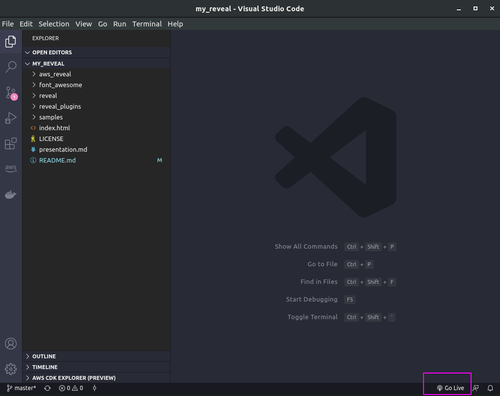

# Beautiful Presentations
Some professionals need to prepare slides for presentations many times a month. There are many challenges in this task. One of these challenges is to organize the thoughts. A good way to organize them is to write down in a text file, or in a Markdown like this:

```markdown
# Presentation
This is my first slide

---

## Intro
Hi, I am Wesley.

---

## Thanks
Bye Bye
```

Other common problem is to ensure that all slides have the same theme, fonts, colors... when you copy something from a website, the fonts and formats come together, making your slides look like a mosaic. To solve this problem, you need to remember to paste in plain text only, ignoring the source formatting.

## Reveal.js and my theme

Developers love to create content as code. Why not presentations? With reveal.js you can create presentations from Markdown and HTML.

This customization enables a special plugin for making notes in the slides and adds 2 themes for AWS presentations: a light and a dark one.

## How to use

First, I recommend you installing a very useful extension for VSCode: Go Live. This extension allows you to start a simple HTTP server from your current folder.




Then, you will need to create a folder and get 2 files. If you want the light theme, type this on your terminal:

```shell
mkdir my_important_presentation
cd my_important_presentation
wget https://raw.githubusercontent.com/wesleyit/my_reveal/master/samples/light.html
wget https://raw.githubusercontent.com/wesleyit/my_reveal/master/samples/light_presentation.md
code .
```

If you want the dark theme, type this instead:

```shell
mkdir my_important_presentation
cd my_important_presentation
wget https://raw.githubusercontent.com/wesleyit/my_reveal/master/samples/dark.html
wget https://raw.githubusercontent.com/wesleyit/my_reveal/master/samples/dark_presentation.md
code .
```

Then, edit your markdown file, save it and click **Go Live**. Your browser will open the presentation. 

