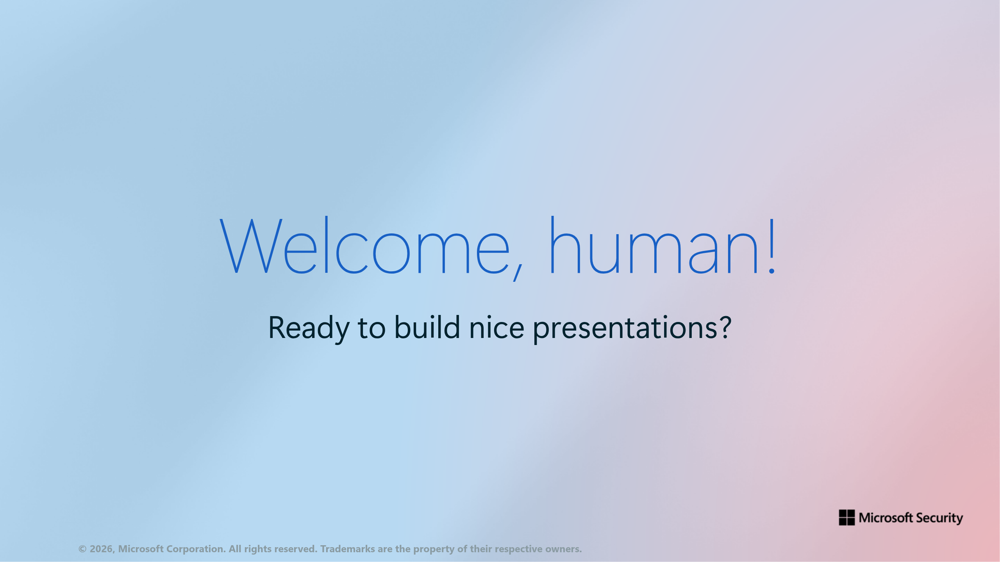
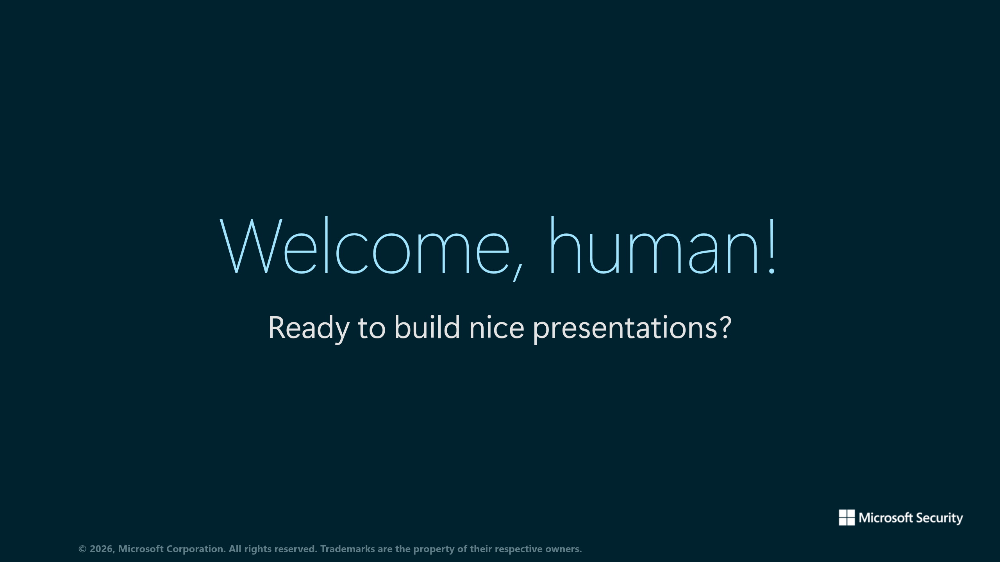

# Beautiful Presentations

Create clean, on-brand slide decks straight from Markdown, powered by
[reveal.js](https://revealjs.com/) and a pair of custom Microsoft themes
(light and dark).




## Why?

Professionals often need to build slides several times a month, and two problems
show up again and again:

- **Organizing ideas.** Writing in plain Markdown lets you focus on the content
  first and the styling later:

  ```markdown
  # Presentation
  This is my first slide

  ---

  ## Intro
  Hi, I am Wesley.

  ---

  ## Thanks
  Bye Bye
  ```

- **Keeping a consistent look.** When you copy content from the web, fonts and
  formatting come along and turn your deck into a mosaic. With a single theme
  applied to every slide, everything stays visually consistent.

## What's included

- **Two Microsoft themes** — a light and a dark variant that share the same
  structure and only differ in their color tokens.
- **Microsoft fonts** — Segoe Sans Display for text and CaskaydiaCove Nerd Font
  for code.
- **Branded backgrounds** — ready-to-use wallpapers under
  [`microsoft_reveal/backgrounds`](microsoft_reveal/backgrounds).
- **Chalkboard plugin** — draw and take notes on your slides during a talk.
- **Code highlighting** — syntax highlighting via the Monokai theme.

## Themes

| Light | Dark |
| ----- | ---- |
| `microsoft_light_theme.css` | `microsoft_dark_theme.css` |
| White background, dark-blue text, blue headings | Dark-blue background, off-white text, light-blue headings |

Each theme is organized in three layers: the raw brand palette, the typography,
and the semantic color tokens. To tweak colors, edit only the semantic tokens in
the `:root` block — everything else is shared.

## How to use

First, install the handy **Live Server** extension for VS Code. It lets you
serve the current folder over a simple HTTP server.

Create a folder and download the two files for the theme you want.

**Light theme:**

```shell
mkdir my_important_presentation
cd my_important_presentation
wget https://raw.githubusercontent.com/wesleyit/my_reveal/main/samples/light.html
wget https://raw.githubusercontent.com/wesleyit/my_reveal/main/samples/light_presentation.md
code .
```

**Dark theme:**

```shell
mkdir my_important_presentation
cd my_important_presentation
wget https://raw.githubusercontent.com/wesleyit/my_reveal/main/samples/dark.html
wget https://raw.githubusercontent.com/wesleyit/my_reveal/main/samples/dark_presentation.md
code .
```

Then edit the Markdown file, save it, and click **Go Live**. Your browser opens
the presentation. Use the arrow keys to navigate and press `B` to toggle the
chalkboard.

## License

Released under the [MIT License](LICENSE).
